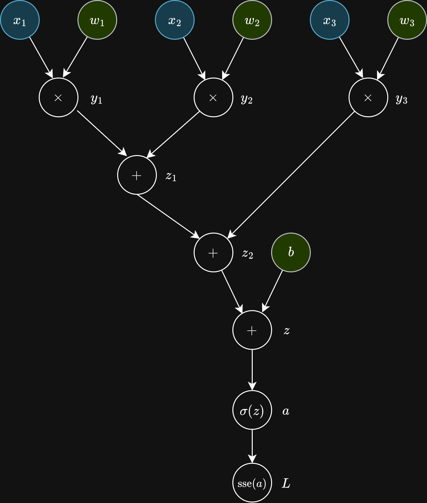

# Autograd playground

Use this repository to follow along with the talk on building your own autograd engine from scratch.

## What will be building at the end of the talk

**Code**:

```bash
# Input dataset (each row is a sample with 3 features)
X = [
    [1, 0, 0],
    [0, 0, 0],
    [1, 1, 0],
    [1, 0, 1],
    [0, 1, 0],
    [0, 0, 1],
    [1, 1, 1],
    [0, 1, 1],
]

# Corresponding expected outputs (labels)
Y = [0, 0, 0, 0, 1, 1, 1, 1]

# Create a neuron with 3 inputs (3 weights + 1 bias)
decision_neuron = Neuron(3)

# Train the neuron using the dataset
train_neuron(neuron, X, Y)

# Test the neuron on unseen input to evaluate generalization
prediction = decision_neuron([0, 0, 0.95])

print(f"Confianza en la predicción: {prediction.data}")
print("Decisión:", "Ir a la universidad" if prediction.data > 0.5 else "Quedarse en casa")

# Visualize the final computation graph of the prediction
visualize_computational_graph(
    last_node = prediction,
    file_path = "visualization.html",
    verbose = True
)
```

**Computational graph**:

<center>

</center>

## Installation

To install the project dependencies, run:

```bash
conda env create -f requirements.yaml
```

We’ll build the autograd engine using only Python, with no third-party dependencies required—except for one: we'll use pyvis to visually render the computational graph of the single neuron we’ll construct.

## References

- [Positron builder](http://github.com/mikhael1729/positron_builder/)
